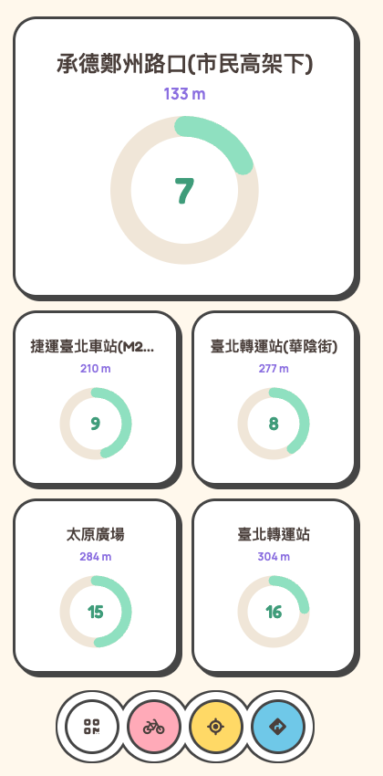

# YouBike 車輛查詢

顯示鄰近 YouBike 站點即時車位與租借狀況的 PWA，支援定位、QR Code 分享與一鍵導航。

A lightweight PWA that shows nearby YouBike station availability in real time, with geolocation, QR code sharing, and one-tap navigation to Google Maps.

線上版本：https://youbike-6n2.pages.dev/



## Features

- 📍 依目前位置自動列出全台最近的 YouBike 站點與距離
- 🚲 即時顯示可借車輛數 / 可還空位數，含電動輔助車數量
- 🔄 每 30 秒自動刷新一次
- 📷 顯示 QR Code，方便分享網站給他人
- 🧭 一鍵在 Google Maps 開啟站點導航
- 📱 支援加入主畫面的 PWA（standalone 模式）

## Stack

- 前端：純 HTML / CSS / JavaScript（無框架）
- 後端：[Cloudflare Pages Functions](https://developers.cloudflare.com/pages/functions/)（[`functions/api/youbike.js`](functions/api/youbike.js)）作為 API proxy，透過[交通部運輸資料流通服務（TDX）](https://tdx.transportdata.tw/)抓取全台各縣市公共自行車即時資料並依距離排序

## Local development

Requires a free TDX account (see below) with credentials in `.dev.vars`:

```
TDX_CLIENT_ID=xxxx
TDX_CLIENT_SECRET=xxxx
```

```bash
npx wrangler pages dev . --port 1234
```

## Deploy

```bash
npx wrangler pages deploy . --project-name=youbike
```

Also requires `TDX_CLIENT_ID` / `TDX_CLIENT_SECRET` set as Cloudflare Pages environment variables (secrets) — see the project's Settings → Environment variables in the Cloudflare dashboard, or:

```bash
npx wrangler pages secret put TDX_CLIENT_ID --project-name=youbike
npx wrangler pages secret put TDX_CLIENT_SECRET --project-name=youbike
```

Get these by registering a free account at [tdx.transportdata.tw](https://tdx.transportdata.tw/), then creating an API application under 會員中心 (member center) to obtain a Client ID / Client Secret.

## Credits

App icons: [Bicycle icon](https://www.flaticon.com/free-icon/bicycle_9842417) by [Magnific](https://www.flaticon.com/authors/magnific) from [www.flaticon.com](https://www.flaticon.com/)

## License

[MIT](LICENSE)
